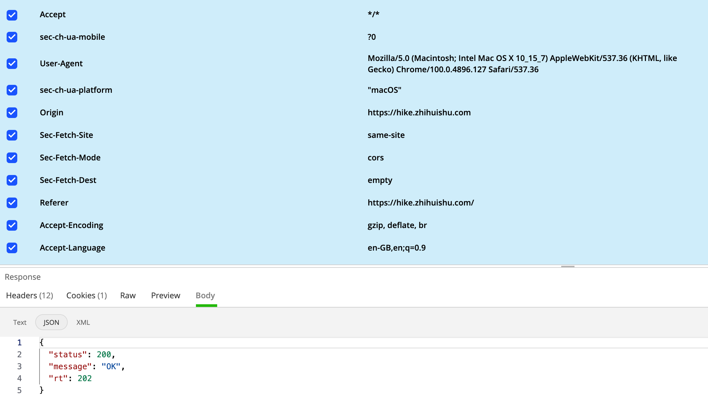

## ZHS Fucker 食用指北

#### WTF?
这是一个 Python3 的自动脚本, 用于自动刷智慧树课堂课程, 为你节约有限的生命.
#### WHY?
自从智慧树的播放页面用了个窒息的 JavaScript 混淆之后, 各种前端的脚本都没法用了. 因为它会检查 DevTools 是否打开, 如果开了就无法继续运行, 要分析的话由于混淆, 解读很麻烦. 于是我打算直接抄家, 入它后端, 所以便有了该脚本(虽然最后还是被逼着反混淆了前端代码...)


#### 准备工作
你准备以下东西
* _Python3.10_ 及以上版本(或自行改写旧版不兼容的语法)
* _requests_ 库
* _selenium_ 库

以下内容若不使用 _selenium_ 则可忽略
* 兼容 _selenium_ 的浏览器(建议 _Chrome_)
* 浏览器对应的 [_WebDriver_](https://www.selenium.dev/documentation/webdriver/getting_started/install_drivers/)
* 将 _WebDriver_ 文件路径添加到系统 `PATH` 或配置文件

#### 如何使用
本块分为 `Login`, `Fxxking`.  
`Login` 使用 _selenium_ 操作浏览器登录来获得 `Cookies`, 若你想自己获取记得给 `cookies` 属性赋值就行， 不一定要调用 `login` 方法  
`Fxxking` 就是真正开始刷进度了, 现在支持用命令行参数和 `API` 两种方式开干

###### Login
配置文件 _config.json_ 中有以下字段:
```JSON
{
  "username": "",
  "password": "",
  "webdriverPath": null,
  "logLevel": "INFO"
}
```
配置文件如果没有的话会在 _main.py_ 执行时自动创建.  
用户名与密码填入配置文件即可开启自动登录, 不填写将以交互形式输入缺失信息.  
如果非常用地登陆会需要短信验证, 你应该先手动登陆一次, 以让你的所在地列入白名单.  
_WebDriver_ 地址留空将从系统 `PATH` 中搜索文件.

`API` 指北: _Python3_ 登录样例 (如果你想单独用该模块的话)
```Python
from fucker import Fucker
fucker = Fucker()
fucker.login(username:str, password:str, webdriver_opts:dict)
# webdriver_opts 是会传入 WebDriver 的额外参数
# 配置文件中填入的路径参数将以 Key-Value 传入, 可别直接传入，因为貌似我传路径参数的用法快被 deprecated 了，故此选项自由度给高点，方便以后修改用法

fucker.cookies = {}
# 如果你不想使用 selenium 
# 也可直接传入符合 requests 库要求的 cookies
# 该 cookies 会覆盖原有的, 请确保它是完整的智慧树 cookies，因为 uuid 需要从 cookies 中解析
```

###### Fxxking
登录之后就可以开干，例如你想要干 ID 为 `"114514"` 的课程，可以这样做:
```bash
cd fuckZHS
python main.py -c 114514
```
什么？不知道课程 ID? 进入课程界面就可以在网址里看到了.
更多选项请使用 `-h` 查看.

运行结果如下:


`API` 指北: 一段伪示例如下
```Python
from fucker import Fucker

fucker = Fucker()
# 或者更进阶一些
fucker = Fucker(speed=1.25, end_thre=0.91)
# 以上控制播放速度以及终止临界值
# 播放速度正常最高也就1.25, 但似乎更高的服务器也接受
# 不过怕暴露就谨慎些吧
# 智慧树把高于一定百分比的进度视为完成, 0.91 保险一点
# 以上俩参数仅对视频有效, 其他的内容就只有进度0或1
fucker.login()
fucker.fuckCourse(courseId) # 把整个课程都干了
fucker.fuckVideo(courseId, fileId) # 只干一个视频
```

指北就这些啦, 代码很少可以自己看.


## 后记
这一段算是授之以渔吧, 毕竟网站以后更新可能会改内容, 我又没时间更新, 就先把思路写在这. 但要注意, 这个混淆肯定引入了随机量, 不可完全照搬该思路.  
过程中用到的文件样本大多都在 _decrypt_ 目录下压缩档里.

#### chapter 0: Too Young Too Naive
本以为从后端入手会很轻松, 没想到一开浏览器开发者模式就遇到了问题,  
一旦监测到 DevTools, 网页界面就立即停止响应.  
这还不简单, 手动把相关 JavaScript 无脑删不就行, 源码都在我手上有什么好怕的.

紧接着一开源码:


好家伙《乱码1/2》

不过这也没什么, 我本来就只是想抓个包, 用别的工具就是了.

抓包得到向服务器报告进度的内容:  
Headers:


Params:

敏感信息被替换了  
你看看这些人多不专业, 拿 `GET` 干 `POST` 的活, 而且那个 `uuid` 根本就不是真的 UUID, 七八个随机字符而已.  

不过我们一路顺风, 成功就在眼前.  
这时可以看到一个正常的响应是
```JSON
{
  "status": 200,
  "message": "OK",
  "rt": 202
}
```
`rt` 是服务器返回的观看进度.

包里大部分参数都很直接, 我们照搬便是.  
`courseId` 我们可以从浏览器链接里得知,  
`fileId` 每个章节的都不一样, 可以从“https://studyresources.zhihuishu.com/studyResources/stuResouce/queryResourceMenuTree” 中获取的JSON 中得到, 不再赘述.

剩下只有 `signature` 不明, 不过大概是个防止多次提交的随机字符串罢了, 这群人取名似乎一直不太行.

然后一试
```JSON
{
  "status": 200,
  "message": "OK",
  "rt": null
}
```
???  
为何就返回个 `null`, 为了解决这个问题我快把浏览器内核用 _Python_ 实现了, 一直以为就是个 `Headers` 或者 `Cookie☆` 的问题.  
结果最后才发现在 `Params`, 而且就是里面那个该死的 `signature` 出了问题.  
这次他们取对名字了, 这真是个签名, 必须和其他内容一套才能有 `rt`.  
想要自己生成这个 `MD5` 签名就只能从前端代码里找 Salt 等数据.

没办法, 开始人生第一次反混淆 JS 吧...

#### chapter 1: At Beginning, It's Just Chaos
开头这个站点名就是万恶之源了, 话说为什么叫“加密”, 只是混淆而已, 和加密相差太远了, 只能说连名字都取的很 Obfuscated.

首先得把这些诡异变量重命名一下, 在[_这个站点_](https://deobfuscate.io)可以初步反混淆, 去掉一些简单的函数 wrapping 并重命名变量, 新变量当然是随机的, 只是好读一些.

#### chapter 2: Let There = Light
初步反混淆后

这下好多了, 可以看到开头有一行超大的列表, 看起来是 Base64, 解码后是乱码, 是被加密了.

再观察一下可以发现一个函数出现的次数很多

这个 nyko 便是负责解密的函数

要解密 nyko 就需要手动去掉一堆无用的循环和判断.  
这个混淆后版本里充斥着各种看起来有意义的字符串, 甚至有些就是混淆前代码里的, 但他们被拿来进行无意义的比较和循环, 这样做可以同时迷惑破解着和你的 CPU.

总之反混淆出来是这样一个简单的解密程式, 用 _Python_ 重新实现了
```Python
def decrypt(index:str, salt:str):
    index = int(index, 16)
    encrypted = b64dec(table[index])
    salt = salt.encode()

    mod_sum = 0
    ar = list(range(256))
    for i in range(256):
        mod_sum = (mod_sum + ar[i] + salt[i % len(salt)]) % 256
        ar[i], ar[mod_sum] = ar[mod_sum], ar[i]
    mod_sum = 0
    n = 0
    decrypted = ""
    encrypted = encrypted.decode()
    for i in range(len(encrypted)):
        n = (n + 1) % 256
        mod_sum = (mod_sum + ar[n]) % 256
        ar[mod_sum], ar[n] = ar[n], ar[mod_sum]
        decrypted += chr(ord(encrypted[i]) ^ ar[(ar[mod_sum] + ar[n]) % 256])
    return decrypted
```

_JavaScript_ 原版其实在 Base64 解码后还有个诡异的手动 URLEncode 完了又调用 `decodeURIComponent` 解码的操作, 一开始我把它删了, 结果竟然生成内容不一样.  
似乎是 _JavaScript_ 的 `atob` 似乎会保留非法的内容? 经过看似无意义的 URL Encode&Decode 会把这些字符丢弃掉, 只能说混淆者真是钻研了折磨人的极致了, 好在 _Python_ 的 `b64dec` 默认丢弃这些内容.

接下来尝试对列表内容解密, 发现还是乱码...

没办法继续化简开头的函数.  
发现程式开头有一段循环, 把列表开头和结尾的俩无意义的东西扔了, 顺带把这个列表 Rotate 了138位, 用 _Python_ 表示就是 `deque.rotate(-138)`  
大概这个值是动态的, 再混淆一次不一定是138.  
旋转后的列表我已经放入 _decrypt.py_ 文件中


解密之后常量已经可以看到了, 但其中仍有很多垃圾信息.  
其中有个模式, 就是混淆版本会在一个 `Object` 内包装一堆简单的函数, 比如加减和比较, 然后取个无意义的名字. 结合那一堆无意义的变量来做比较判断, 以此来表示 `Boolean` 值, 只要搞清这个可以去掉很多无意义的判断语句
```JavaScript
var Wtf = {
       RvuT: function (dyo, bie){
       return dyo === bie;
       },
       oPhT: function(Jely, Inp, Stb){
       return Jely(Inp, Stb)
       },
       stEbU: "d0gky", RlVDj: "rk8Eb"
    }
if (Wtf.oPhT(Wtf.RvuT,Wtf.stEbU,Wtf.RlVDj){
    console.log("WTF");
    }
    
//以上这一大坨， 也就等价于
if (false){
  console.log("who cares what I've logged");
  }
  
//也就等价于
// do fucking nothing but consuming your CPU, storage, network bandwidth and god damn time
  
```

#### chapter 3: small step, Giant Leap
要继续解读的话这些乱码的函数名字太难读了, 以功能来重新命名吧, 顺便去掉无用的，重复的部分:


怎么说呢, 虽然是很繁琐的一件事, 但看着大批大批代码被删有种莫名的快感, 我当游戏玩了一久.

玩得差不多的时候突然想起来我好像不必把所有代码反混淆, 找到 `MD5` 相关的代码就好啊.  
现在代码也只有一千多行了, 挺好找的才是.  
随手一翻发现
```JavaScript
function jobany(params) {
      var lennora = kenshin.ADD(kenshin.ADD(
        kenshin.ADD(kenshin.ADD(kenshin.ADD(
          kenshin.ADD(kenshin.ADD(kenshin.ADD(
            kenshin.ADD("o6xpt3b#Qy$Z", params.uuid
          ), params.courseId),  params.fileId
        ), params.studyTotalTime),  params.startDate
      ), params.endDate),  params.endWatchTime
    ), params.startWatchTime),  params.uuid);
      console.log(lennora);
      return kenshin.APPLY($md5, lennora);
    }
```
诶嘿, 改函数名有效果了, 是盐! 它加了盐! (顺带特想吐槽下这个自动生成的对象名 `kenshin`，什么艾莉丝)

盐(bushi):


有了这个我们可以自己签名了, 没想到人都这么大了还靠在自己作业上签名来骗人()
```Python
from hashlib import md5
from utils import ObjDict # 这是一个我从 dict 继承后魔改的玩意儿，可以用 JavaScript 风格访问 dict

SALT = "o6xpt3b#Qy$Z"

def sign(p:dict):
    p = ObjDict(p)
    raw = SALT + p.uuid + p.courseId + p.fileId + p.studyTotalTime + \
           p.startDate + p.endDate + p.endWatchTime + p.startWatchTime + p.uuid
    return md5(raw.encode()).hexdigest()
```

我们也算是**努力**完成作业了

已经1000%了()


给把如此凌乱的内容看到最后你一些安慰吧  
祝你学习像 Anya 一样好, 料理如 Yor 一般出色

(sauce: Pixiv; pid:97128620) 放 GitHub 仓库不能算转载吧?
